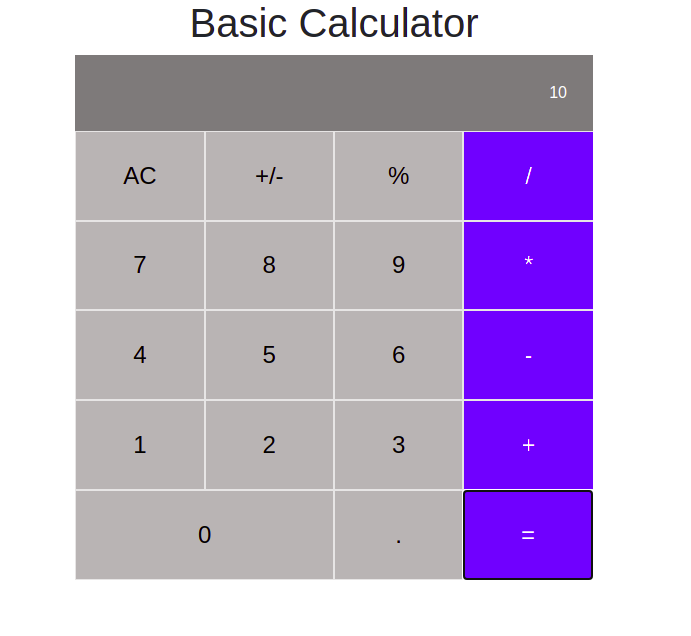

# React Calculator
This is a calculator made with React, using stateful component class and stateless component function by passing props to functions from their parent component class.

# Screenshot

## Built With
- Javascript
- React framework
- Webpack

## Getting started
   To get a local copy up and running follow these simple example steps and type the necessary  highlited commands on your terminal.
  1- Clone the project by typing `git clone git@github.com:che30/react-calculator-app-project.git` 
  2- cd `react-calculator-app-project`
  3- `npm run start`
# Setup
  
# TESTS

## Click the link below to see the live demo
- [Click this link to see live demo](https://react-calculator-app-project.herokuapp.com/)

## Author
**Che Blanchard**
- GitHub: [@che30](https://github.com/che30)
- LinkedIn: [Che Blanchard](https://www.linkedin.com/in/che-nsoh-9455271b0/)
- Twitter: [@che55085128](https://twitter.com/che55085128)
## Acknowledgements
- Microverse
##  Contributing

Contributions, issues, and feature requests are welcome!

## Show your support

Give a ⭐️ if you like this project!
